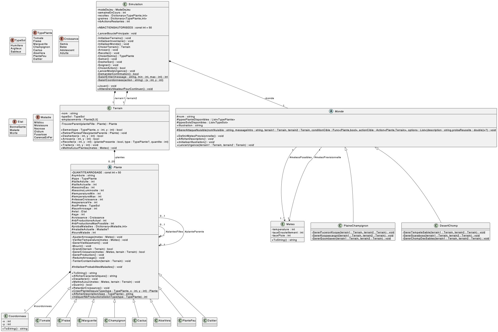

```
        __           
     .-'  |          
    /   <\|         
   /     '          
   |_.- o-o          
   / C  -._)\       
  /',        |        _____ _   _  _____                           _____ 
 |   `-,_,__,'       |  ___| \ | |/  ___|                         /  __ \
 (,,)====[_]=|       | |__ |  \| |\ `--.  ___ _ __ ___   ___ _ __ | /  \/
   '.   ____/        |  __|| . ` | `--. \/ _ \ '_ ` _ \ / _ \ '_ \| |    
    | -|-|_          | |___| |\  |/\__/ /  __/ | | | | |  __/ | | | \__/\
    |____)_)         \____/\_| \_/\____/ \___|_| |_| |_|\___|_| |_|\____/
```

Bienvenue dans **ENSemenC**, un jeu de simulation de potager immersif et stratégique.\
Gérez vos semis, affrontez la météo, repoussez les nuisibles et faites prospérer votre jardin dans deux mondes **inspirés de l’univers Mario**.

___

## Sommaire

1. [Présentation du jeu](#1-présentation-du-jeu)
2. [Objectif](#2-objectif)
3. [Règles du jeu](#3-règles-du-jeu)
4. [Modes de jeu](#4-modes-de-jeu)
5. [Description des mondes (particularités, nuisibles, plantes, etc.)](#5-description-des-mondes-particularités-nuisibles-plantes-etc)
6. [Mécanique des plantes](#6-mécanique-des-plantes)
7. [Interface du jeu](#7-interface-du-jeu)
8. [Lancer le jeu](#8-lancer-le-jeu)
9. [Structure du projet](#9-structure-du-projet)
10. [Diagramme UML](#10-diagramme-uml)
11. [Crédit](#11-crédit)

___

## 1. Présentation du jeu

**ENSemenC** est un jeu console où vous incarnez un apprenti jardinier chargé de cultiver, protéger et récolter un potager sur deux terrains.  
Chaque semaine, vous affrontez les aléas climatiques et les attaques de nuisibles, tout en optimisant vos plantations pour survivre ou prospérer. !

___

## 2. Objectif

> Réussir à faire prospérer vos cultures le plus longtemps possible en semant, arrosant, soignant et récoltant vos plantes... tout en faisant face à la météo et aux événements d'urgence.

___

## 3. Règles du jeu

- Vous disposez de **2 terrains de 5x5 cases** pour cultiver vos plantes.
- Vous commencez avec **2 graines de chaque plante** propre au monde sélectionné.

- Chaque semaine, vous pouvez effectuer **jusqu'à 8 actions** parmi :
    - **Arroser** une plante.
    - **Récolter** ses productions.
    - **Semer** une nouvelle graine.
    - **Désherber** une plante.
    - **Soigner** une plante malade.
- Vous n'êtes pas obligé de réaliser 8 actions à chaque tour, vous avez la **possibilité de passer au tour suivant** dès que vous le souhaitez, ou même de **quitter le jeu**.
- Une météo aléatoire affecte chaque semaine vos cultures :
    - Température, ensoleillement, et pluie.
- Des **maladies** peuvent apparaître selon des probabilités définies par plante. Si une plante malade n'est pas soignée dans les deux semaines qui suivent sa contamination, elle meurt...
- Les **plantes grandissent** à leur rythme et produisent des récoltes en atteignant l’âge adulte.
- Les **plantes ne sont pas éternelle**... Elles meurent naturellement une fois leur durée de vie à l'âge adulte dépassée.

___

## 4. Modes de jeu

### Mode classique

- Simulation en **semaines** (1 tour = 1 semaine).
- Chaque semaine, vous gérez votre potager à travers les actions.
- La météo affecte vos plantes chaque semaine.
- Les maladies et le vieillissement peuvent causer leur perte.

### Mode urgence

- Se déclenche **aléatoirement entre les semaines** (60 % de chance).
- Un **nuisible spécifique** au monde cible une plante de votre potager.
- Vous avez **3 tentatives pour le repousser** via des 3 actions défensives (différentes selon le nuisible) aux pourcentages de réussite différents.
- Si vous ne parvenez pas à protéger votre plante ciblée, vous pouvez **perdre votre plante, ou encore vos récoltes**,selon l'attaque du nuisible.
___

## 5. Description des mondes (particularités, nuisibles, plantes, etc.)

### Monde 1 - Plaine Champignon

- **Température** : Entre 10°C et 25°C (climat tempéré).

- **Météo** : alternance harmonieuse de pluie et de soleil.

- **Plantes cultivables** : 
    - Tomate 🍅.
    - Fraise 🍓.
    - Marguerite 🌼.
    - Champignon 🍄.

- **Nuisibles** : 
    - Goombaver : dévore une plante s’il n’est pas repoussé.
    - Koopascargot : ralentit la croissance.
    - PuceronKoopa : vole les récoltes d’une plante adulte.

### Monde 2 - Désert Chomp

- **Température** : entre 30°C et 45°C (chaleur extrême).

- **Météo** : temps sec, rares pluies, tempêtes de sable occasionnelles.

- **Plantes cultivables** : 
    - Cactus 🌵.
    - Aloé vera 🪴.
    - Plante feu 🔥.
    - Dattier 🌴.

- **Nuisibles** : 
    - Chomp des sables : détruit une plante.
    - Scaraboss : attaque une plante.
    - Tempête de sable : balaie une plante.

___

## 6. Mécanique des plantes

- Chaque plante a des **besoins spécifiques** :
  - Eau (%), luminosité (%), température min/max (°C).
- Si l’arrosage est inférieur ou supérieur à 50% de ses besoins, la plante meurt.
- Une plante malade 2 semaines de suite meurt aussi.
- Si les conditions préférées de la plante (besoins en eau et lumière, température, sol) sont respectés à ±10%, la plante pousse deux fois plus vite.
- Une plante adulte produit automatiquement selon son type.
- Les plantes ont un cycle de croissance (semis > bébé > adolescent > adulte).
- Lorsque les plantes passent à l'âge adulte, elles prennent leur taille adulte. Si elles n'ont pas l'espace pour grandir, elle meurt.

___

## 7. Interface du jeu

- Le jeu s’affiche intégralement en **console** avec :
  - Illustration ASCII des mondes.
  - Grille des terrains 5x5.
  - Inventaire détaillé (graines + récoltes).
  - Interface de choix stylisée.

- Utilisation de **couleurs** pour :
  - Mettre en valeur les messages importants (erreur, succès, avertissement, attente d'interaction utilisateur).

Exemple d'interface : 
```
                 ⠀⠀⠀⠀⠀⠀⠀⣀⣀⡤⠤⢤⣀⡀
                 ⠀⠀⠀⢀⡤⠚⠉⠑⣀⠔⠐⠢⠀⠈⡹⠶⣄
                 ⠀⠀⡰⠋⠀⠀⠀⠀⡏⢄⣀⡰⢠⠊⠀⠀⠈⠳⡄
                 ⠀⣸⣅⡀⠀⠀⣀⠔⠀⢀⡀⠀⠸⡀⠀⠀⠀⠀⢸⡄
                 ⢀⣿⣿⣾⡭⡭⠐⢢⠊⠁⠈⢣⠀⠙⠢⢄⣠⣴⣿⣷
                 ⢸⠁⠀⠈⠹⣿⣶⣼⣆⣀⣀⣼⣠⣤⣾⣿⠟⠉⠙⢿
                 ⠈⢧⡀⠀⣠⣿⡿⠿⠿⠿⠿⠿⠿⠿⣿⣿⡀⠀⣀⠞
                 ⠀⠀⠈⠉⢩⠃⠀⢀⣤⠀⠀⢠⣦⠀⠀⢸⠉⠉
                 ⠀⠀⠀⠀⢸⠀⠀⠀⠉⡀⠀⢈⠁⠀⠀⢸
                 ⠀⠀⠀⠀⠘⣆⠀⠀⠀⠉⠂⠁⠀⠀⢀⡼
                ⠀⠀⠀⠀⠀⠀⠉⠉⠉⠉⠉⠉⠉⠉⠉

          --- Plaine Champignon - Semaine 2 ---

----------------------------------------------------------

MÉTÉO PRÉVISIONNELLE DE LE SEMAINE À VENIR

Température : 22°C - Ensoleillement : 80% - Pluie : 5%

----------------------------------------------------------

          Terrain 1                     Terrain 2

    1    2    3    4    5         1    2    3    4    5
  +----+----+----+----+----+    +----+----+----+----+----+
1 |    |    |    |    |    |    |    |    |    |    |    |
  +----+----+----+----+----+    +----+----+----+----+----+
2 |    |    |    |    |    |    |    |    |    |    |    |
  +----+----+----+----+----+    +----+----+----+----+----+
3 |    | 🍓 |    |    |    |    |    | 🌼 |    |    |    |
  +----+----+----+----+----+    +----+----+----+----+----+
4 |    |    |    | 🍄 |    |    |    |    |    |    |    |
  +----+----+----+----+----+    +----+----+----+----+----+
5 |    |    |    |    |    |    |    |    |    |    |    |
  +----+----+----+----+----+    +----+----+----+----+----+    

----------------------------------------------------------

MES PLANTES

Terrain 1 :
(3,2) Fraise 🍓 :
  - État : BonneSante
  - Croissance : Semis
  - Taux d'arrosage : 30%
  - Production : 0
  - Taille actuelle : 1

(4,4) Champignon 🍄 :
  - État : Malade
  - Taux d'arrosage : 30%
  - Production : 0
  - Taille actuelle : 1


Terrain 2 :
(3,2) Marguerite 🌼 :
  - État : BonneSante
  - Croissance : Semis
  - Taux d'arrosage : 30%
  - Production : 0
  - Taille actuelle : 1


----------------------------------------------------------

INVENTAIRE

Graines disponibles :

1 - Tomate : 2 graine(s) restante(s)
2 - Fraise : 1 graine(s) restante(s)
3 - Champignon : 1 graine(s) restante(s)
4 - Marguerite : 1 graine(s) restante(s)

----------------------------------------------------------

Que faire ? (Actions restantes : 8/8)

1. Arroser
2. Récolter
3. Semer
4. Désherber
5. Soigner
6. Passer au tour suivant
7. Quitter le jeu

Entrez le numéro de l'action que vous souhaitez réaliser :
```

___

## 8. Lancer le jeu

### Pré-requis

- [.NET 8 SDK](https://dotnet.microsoft.com/en-us/download) installé
- Un éditeur de texte ou IDE comme [Visual Studio Code](https://code.visualstudio.com/)

### Exécution

```
dotnet run
```
___

## 9. Structure du projet

```
ENSemenC
│
├── Program.cs                 // Point d’entrée du jeu
│
├── Simulation.cs              // Logique principale du jeu
│
├── Affichage.cs               // Fonctions d’affichage console
│
├── mondes/                    // Dossier regroupant l'ensemble des classes de mondes
│   ├── Monde.cs               // Classe abstraite des mondes
│   ├── PlaineChampignon.cs    // Monde 1
│   └── DesertChomp.cs         // Monde 2
│
├── Terrain.cs                 // Gestion des plantes sur les terrains
│
├── Coordonnees.cs             // Coordonnées d'emplacement d'une plante sur un terrain
│
├── plantes/                   // Dossier regroupant l'ensemble des classes de plantes
│   ├── Plante.cs              // Classe abstraite des plantes
│   ├── Tomate.cs              // Exemples de plantes
│   ├── Fraise.cs
│   ├── Cactus.cs
│   ├── PlanteFeu.cs
│   └── ...
│
├── Meteo.cs                   // Météo de la semaine
│
├── enum/                      // Dossier regroupant les énumérations (TypePlante, TypeSol, Maladie...)
│   ├── TypePlante.cs         
│   ├── TypeSol.cs   
│   └── ...           
└──             
```

La **matrice d'implication**, le **diagramme UML** et le **rapport technique** du projet sont également disponibles.
___

## 10. Diagramme UML


___

## 11. Crédit

Projet réalisé dans le cadre du module Programmation avancée de l'ENSC.

- Auteur : Lina AMMAR-BOUDJELAL
- Promotion : 2027
- Groupe : 4